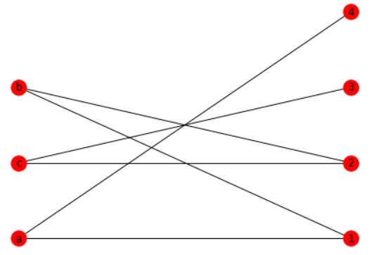
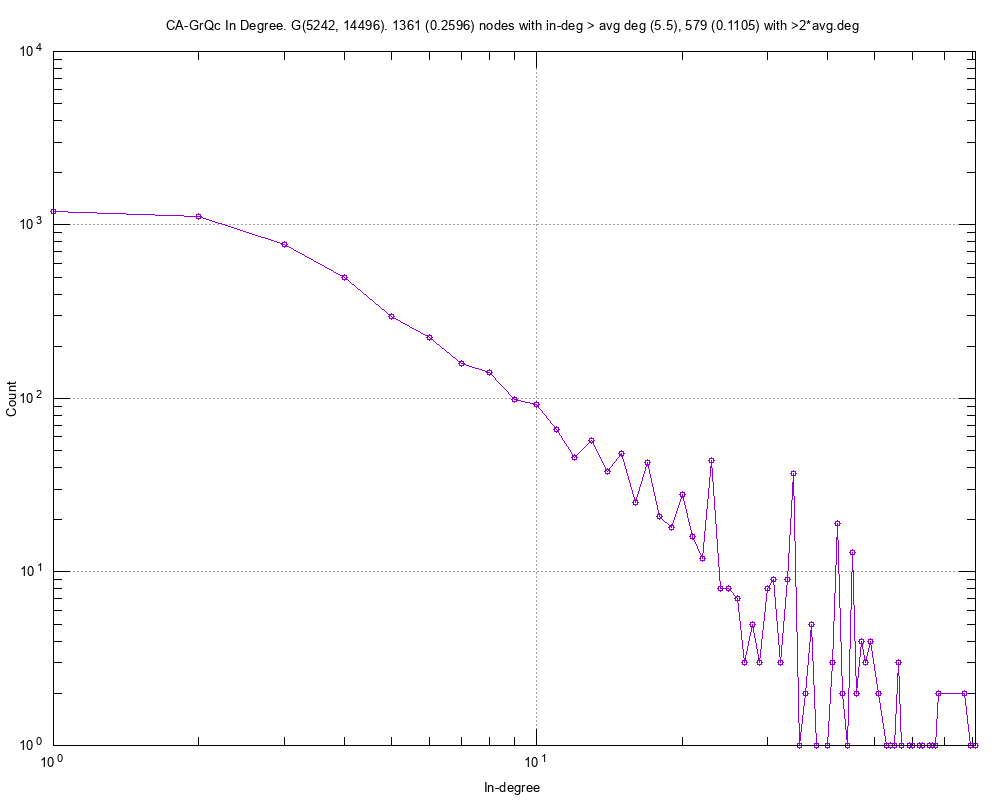
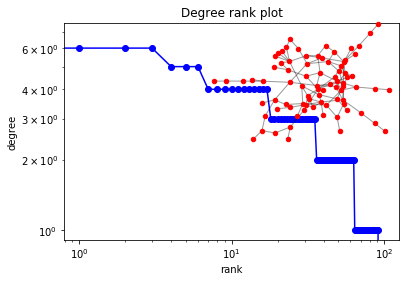
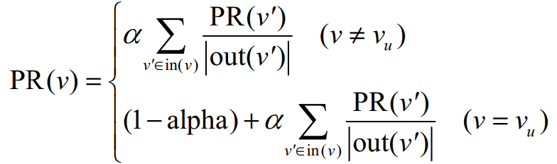
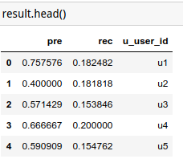
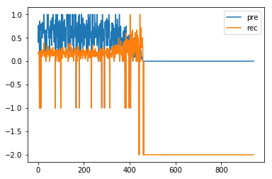
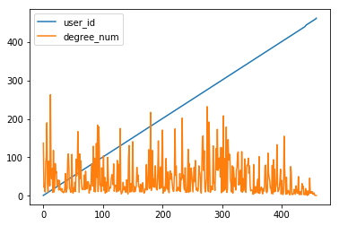
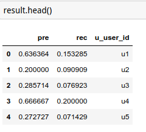
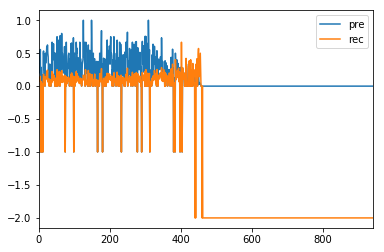

- by 陈小龙

## 1 基础知识学习

### 1.1 学习图的结构

这部分知识以前已经get到了，一般遍历图时分为广度优先和深度优先。

二分图(Bipartite)：这部分属于比较新的内容，通过学习可知二分图是图中的一个特殊模型。即设 G=(V,E)是无向图，其顶点可以分为不相交的两部分(A,B)，且图中每条边所关联的两个顶点分别属于不同的顶点集。

经典的例子，就是如果将用户看做集合A，用户看过的电影看做集合B。如果用户看过某个电影，就在他们之间画上连线。这就是一个典型的二分图的应用场景。

同时，学习了 snap 和 networkx 的用法。具体可以查看 Day_1.1.ipynb 以及 Day_1.1.ipynb。

snap 只能在 python2 环境下使用，这里给出我的配置方法。放在我的Github上：[Anaconda3使用python2环境](https://github.com/calfchen/software-installation-and-use/tree/master/Anaconda3%E4%BD%BF%E7%94%A8python2%E7%8E%AF%E5%A2%83)

使用 snap 查看度的分布：

使用 networkx 查看度的分布：

遍历访问图结点：对于 sanp 可通过图 G.Nodes() ，或者 networkx 的 G.nodes 来遍历结点。

### 1.2 如何基于图模型进行推荐

这一天一直在思考一个问题，如何用图来做推荐。一开始想的是距离某个 user 未连通的距离最近的 item 推荐，但是如何定义距离，以及如何计算距离是一个难点。后来通过查阅资料，看到了 项亮的《推荐系统实战》里面讲了大概的原理。下面给我通过看书得出的自己的理解：

例如，将用户集合表示为U，将物品集合表示为V。则为用户u1推荐与u1没有直接边相连物品 vi。则需要衡量 vi 与 u1 之间的相关性。将相关性最大的 TOP K 物品推荐给用户 u1。

下面需要思考的问题就是，如何衡量用户 u1 与物品 vi 之间的相关性。查阅资料可以，主要取决于3个因素。

- 两个顶点之间的路径数（两个顶点之间的路径条数越多，越相关）
- 两个顶点之间路径的长度（连接两个顶点之间的路径越短，越相关）
- 两个顶点之间的路径经过的顶点（两个顶点之间经过的顶点其度越小，越相关）

定义好相关性之后（本质上相当与李航《统计学习方法》里的策略），其模型就是基于图的模型。则最后一个关键要素为：算法，即怎样有效的计算顶点之间的相关性。

这里使用基于随机游走的 PersonalRank 算法。

- 例如，假设给用户 u 推荐物品，则从 u 对应的节点 Vu 出发随机游走，当游走到任一节点时，按照概率 alpha 决定是两种选择：①继续游走，②停止这次游走并从 Vu 节点开始从新游走。
- 如果选择继续游走，则从当前节点指向的节点中按照均匀分布随机选择一个节点作为游走下次经过的节点。
- 这样，经过多次之后，每个物品被访问的概率会收敛到一个数。最终推荐给物品的权重大的。

这里就有一个问题，只考虑用户是否喜欢某个物品，却无法考虑对某个物品的喜欢程度。

如果想要具体的内容，则可以将评分的倒数设置为对应的距离权重，则评分越高，距离越近，相关性越强。

## 2 项目实战

代码部分参见 Day_2.ipynb 部分。

这里继续使用的是 ml-100k 的数据。因为通过检查发现，TAL dataset 的图不是连通的，而且绝大部分的度为 1 ,这就导致其并不适合用做图模型，或者说我并没能够找到一个有效的方法。觉得从语义 NLP 组来分析题目，找相似性则更加有效。

整个流程围绕下面3个问题来展开：

- Given a user, recommend top K items.
- Given a user, recommend top K users.
- Given an item, recommend top K items.

同时，使用 Recall 和 Precision 两个指标来进行评价。

下面具体讲解下算法步骤，主要分为两步：训练和预测。

训练：

输入：图结构 G，随机游走概率 alpha 以及需要训练的节点 root

输出：所有节点计算的分数 rank（计算方法见上图2）

- ① 将所有节点表示为 dict 形式，并初始化为 0. 将要训练的节点 root 初始化为1，即 rank[root] = 1.
- ② 设置随机游走的次数 step
- ③ 如果游走次数达到 step，则退出，到第④步。否则，遍历图中节点 node，再以均分分布的形式计算 node 的邻接点。根据上图图2公式计算，并将结果保存。
- ④ 判断是否到达 step, 没有到达则返回到③，否则返回 rank。

预测：

输入：test_df，训练输出的 rank, 需要预测的 root, 推荐的top k的 k 值

输出：推荐的 top k 信息

- 只需计算相关的信息的 rank 排名，返回 top k 的即可。

**结果**

一开始，直接肉眼观察信息，对比推荐的 top 10的电影，与 user 真正评论过得电影之间做个对比。从电影属性上看相关性较强。但是这样只能一次对比一个用户。对于想要看看整体的推荐效果的话，就需要从评价函数入手了。这里使用召回率 recall 和精确率 precision。

这里给出肉眼检查的结果（在 Day_3 利用详细的代码）

user1 评分前十的电影 | 推荐给 user1 的前十的电影
|---|---|
Usual Suspects, The (1995) | Leaving Las Vegas (1995)
Postino, Il (1994) | English Patient, The (1996)
Dolores Claiborne (1994) | Scream (1996)
Kids in the Hall: Brain Candy (1996) | Liar Liar (1997)
Mystery Science Theater 3000: The Movie (1996) | Air Force One (1997)
Maya Lin: A Strong Clear Vision (1994) | Titanic (1997)
Cinema Paradiso (1988) | Schindler's List (1993)
Brazil (1985) | One Flew Over the Cuckoo's Nest (1975)
Return of the Jedi (1983) | Mission: Impossible (1996)
Sling Blade (1996) | E.T. the Extra-Terrestrial (1982)

看的一脸懵*，wtf?。下面给出中文：

user1 评分前十的电影 | 推荐给 user1 的前十的电影
|---|---|
非常嫌疑犯, The (1995) | 离开拉斯维加斯 (1995)
邮差, Il (1994) | 英国病人, The (1996)
热泪伤痕 (1994) | 惊声尖叫 (1996)
死神来临: Brain Candy (1996) | 大话王 (1997)
神秘科学影院3000: The Movie (1996) | 空军一号 (1997)
林璎：强烈而清晰的洞察力 (1994) | 泰坦尼克号 (1997)
天堂电影院 (1988) | 辛德勒的名单 (1993)
妙想天开 (1985) | 飞越疯人院 (1975)
星球大战3：绝地归来 (1983) | 碟中谍 (1996)
弹簧刀 (1996) | E.T.外星人 (1982)

看起来大部分都是剧情片，和我的口味有点像，里面有不少熟悉或喜欢的电影。这样如果我也评论过这些电影，则可将它评论高分的电影直接推荐给我，我有大概率会去看。

## 3 评价指标

|||true|true|
|---|---|---|---|
|||1|0|
|predict|1|true positive(TP)|false positive(FP)|
|predict|0|false negative(FN)|true negative(TN)|

- recall = TP / (TP + FP)
- precision = TP / (TP + FN)

此外，还有一些其他的指标。

- F1 = 2 * precision * recall / (precision + recall)。综合 recall 和 precision 的情况。
- ROC 曲线，见下图, 3条 roc 曲线(图片来自于维基百科)

- AUC：为 ROC 曲线下面的面积。
- Gini: ROC 曲线与斜线之间的面积。

这里使用 recall 和 precision 两种分式，其他的指标可以此计算出来。

核心代码：

    def precision(test, user, top_k_item):
        r_all = len(top_k_item)
        if r_all != 0:
            recom_list = [int(key[0][1:]) for key in top_k_item]
            data = test[test.u_user_id==user]
            r = len(data[(data.item_id.isin(recom_list))].item_id.unique())
            p = r*1.0/r_all
            return p
        else:
            return -2

    def recall(test, user ,top_k_item):
        tu = test[test.u_user_id == user]['item_id'].nunique()
        if tu != 0:
            recom_list = [int(key[0][1:]) for key in top_k_item]
            data = test[test.u_user_id==user]
            r = len(data[(data.item_id.isin(recom_list))].item_id.unique())
            rec = r*1.0/tu
            return rec
        else:
            return -2

在 Day_2 的实验结果中，对于user1而言，如果推荐 1600 个电影，p = 0.0909，r = 1.0；如果推荐 100 个电影，p = 0.55, r = 0.40146。结果也表明了精确率和召回率是与推荐的电影数的多少是相关的。推荐的越多，则召回率越高，表明大部分相关的物品都推荐到了，而精确率较低，表明推荐的大部分物品都是不相关的。

因此，在不同的场景，可以选择不同的 k 值，例如在电影推荐中，我们希望尽可能推荐出用户喜欢的电影，那么就多推荐给用户一些电影，这样能保证较高的召回率。而在识别垃圾邮件的时候，将一个正常的邮件判定为垃圾邮件比没有识别出来一个垃圾邮件严重的多，因此，我们要保证精确率，做法就可能将垃圾邮件的 k 值减少一些来提高精确率。

## 4 不同算法之间的对比

### 4.1 PersonalRank 算法

具体参见 Day_3 的文件

循环训练每一个用户，分别推荐其训练集相关物品数量的 1/4，再计算 precision 和 recall，将结果保存在 result.csv 文件中。总共用时约 2 hours。

计算的结果如下：

id 大于 400 的用户，他们的度比较小，因此大部分都没有计算，在函数里直接返回-2，而有些添加对应的边之后，图不是连通的，直接返回-1。

下面是 test 文件对应的每个用户的 degree，可以看出来约大于 400 以后的 degree 为 0.

运行时间：接近两个小时。

核心代码：

    def train(G, alpha, root):
        rank = {x:0 for x in G.nodes}
        rank[root] = 1
        for k in range(20):
            tmp = {x:0 for x in G.nodes}
            for i in G.nodes:
                for j in G.neighbors(i):
                    if j not in tmp:
                        tmp[j] = 0
                    tmp[j] += alpha * rank[i] / len(list(G.neighbors(i)))
                    if j == root:
                        tmp[j] += 1 - alpha
            rank = tmp
        return rank

    def predict(data, rank, user, top_k):
        connect_item = [item_id for item_id in list(set(data[data['u_user_id'] == user]['i_item_id']))]
        recommend_item = [(key, rank[key]) for key in rank if key not in connect_item and 'u' not in key]
        top_k_item = sorted(recommend_item, key=lambda x: x[1], reverse=True)[:top_k]
        return top_k_item

### 4.2 Rondom walk 算法

随机游走算法，设置步长为10，总的步骤为10000，运行时间总计 10 mins 左右，远远快于 PersonalRank 算法。计算的 precision 和 recall 的结果如下图：

- 从绘图的结果来看，id 靠前的用户，精确率一般大于召回率。这是由于我们推荐的TOP K中，K值过小（一般是正常的1/4），如果提高 K 值，则会提高召回率，但是会降低精确率。
- 对比 day_3 的数据发现，整体的精确率和召回率比 PersonalRank 低，分析原因在于随机游走不确定性变大导致。

## 5 一些提升思路

① 准确率的提升：现在的模型是按照用户评论了电影，则连接上一条边，没有评论则没有边。没有充分利用评论的分数的信息。可以有2种不同的大的分类：

- 未评论的，用户和物品之间没有连接。
- 评论分数小于等于2的，给上对应边负的权重；评论等于3的，给上权重0；评论大于3的，给上正的权重。利用带权重的图重新计算一边，有可能有提升效果。

② 速度的提升：可以看出在训练用户的时候，各个用户之间是相互独立的。如果能够并行的计算，则可以大大降低计算的速度。